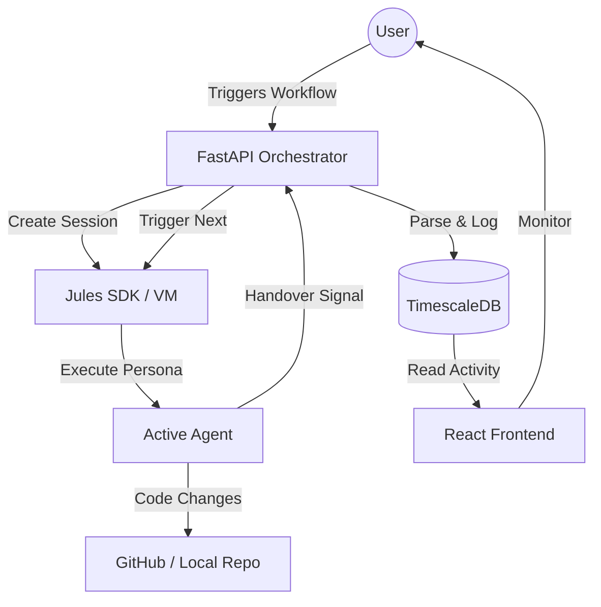

# 🏗️ JAO: System Architecture & Orchestration Blueprint
**Version**: 1.0.0 (Professional Edition)
**Status**: ACTIVE / AUTONOMOUS

---

## 🏛️ Executive Architecture Overview

The Jules Agent Orchestrator (JAO) is a **Cybernetic Firm Infrastructure**. It is not a single application, but an ecosystem designed to manage multiple AI agent sessions simultaneously, maintain persistent technical memory, and execute complex software engineering tasks autonomously.

### 🛠️ Core Technology Stack
| Layer | Technology | Role |
| :--- | :--- | :--- |
| **Frontend** | React 18, Vite, Lucide | Real-time monitoring of agent activity and sessions. |
| **Backend** | FastAPI (Python 3.11) | State machine, orchestration logic, and API gateway. |
| **Orchestrator** | Regex-based Transition Engine | Parses handovers and automates agent rotations. |
| **Database** | TimescaleDB (PostgreSQL) | High-performance storage for activity logs and long-term memory. |
| **AI Engine** | Jules SDK | Dedicated compute per agent session (Jules VM). |

---

## 🔄 The Autonomous Orchestration Loop

The system operates on an **Agent-Native Lifecycle**. Instead of linear execution, it uses a recursive loop where agents check, build, audit, and verify each other.

### 1. The Decision Engine (Orchestrator)
The `OrchestratorEngine` (in `services/orchestrator.py`) is the "brain" that monitors the field. It performs **Handover Parsing**:
- It scans the output of every completed agent session for standard tags (e.g., `[NEXT_AGENT: @pydan]`).
- It extracts the **Context Payload** (the prompt for the next agent).
- It initiates a "Context Transfer" where the results of the previous work are passed to the next specialist.

### 2. Session Lifecycle & Resource Control
- **Limit Management**: The system tracks active UUIDs. If the user sets a limit (e.g., 5 agents), the Orchestrator will queue new tasks until a slot opens up.
- **Teardown**: When an agent signals `Done ✅`, the backend triggers a cleanup function that:
    1. Archives the activity logs to TimescaleDB.
    2. Closes the Jules VM session.
    3. Notifies the Frontend to remove the agent from the "Active Field."

### 3. "The Fielding" (Dynamic Role Assignment)
We use a **Spare Parts Model** for agents. 
- **Active Fielders**: The 5-6 core agents (@pydan, @rita, etc.) who are usually active during construction.
- **On-Demand Subs**: Auditing agents (like `@scalper_auditor`) are kept in the `audit_agents/` folder. They are only "called to the field" when the Architect (@ada) identifies a specific bug or weakness in a module.

---

## 📈 Data Flow Diagram (Mermaid)

---

## 📡 Jules API Integration Detail

### Function: `create_session`
- **Purpose**: Spawns a dedicated AI instance with a specific persona.
- **Data Flow**: `Backend -> Jules -> VM Initialization`.
- **Functions used**: `client.sessions.create(prompt, source, title, require_plan_approval)`.

### Function: `list_activities`
- **Purpose**: The "Persistence Engine." It pulls every command and terminal output from the agent's VM.
- **Data Flow**: `Jules -> Backend -> TimescaleDB`.
- **Functions used**: `client.activities.list_all(session_id)`.

---

## 🚀 Portability & @onboard Logic
The system is designed to be **Zero-Config Portable**.
1. **Verification**: When `@onboard` starts, it identifies the project root.
2. **Scan**: It identifies the "Naming Conventions" of the new project (e.g., is it `scr/` or `app/`?).
3. **Synchronization**: It performs a bulk find-and-replace across all 29+ agent `.md` files, updating the `References` box so every agent knows exactly where to look for the new code.

---

## 🛡️ Future Evolution: The Self-Healing Firm
When a task is complete, the **System Architect (@ada)** is re-assigned to audit the final state. 
- If `@ada` finds no issues, she assigns the **System Auditor (@omega)**.
- If `@omega` also finds nothing, the system flags the project as **STABLE** and asks the user for the next "Epic" or "Feature Request." 

This ensures that the "Firm" never stops until perfection is achieved.
