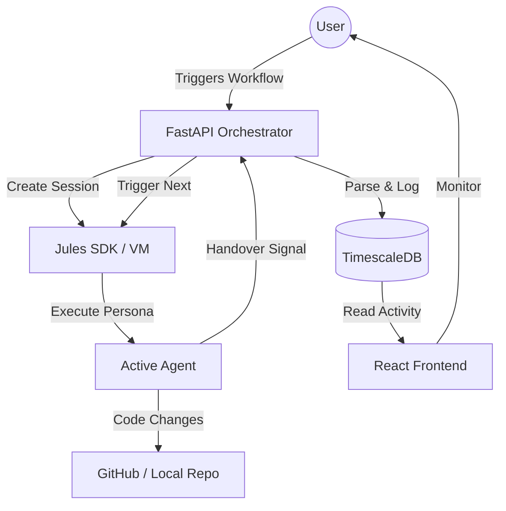

# 🏗️ JAO: System Architecture & Orchestration Blueprint
**Version**: 1.0.0 (Professional Edition)
**Status**: ACTIVE / AUTONOMOUS

---

## 🏛️ 100% Target Architecture Overview

The Jules Agent Orchestrator (JAO) is a **Cybernetic Firm Infrastructure**. This document serves as the **Target Blueprint**. If the current codebase (50%) does not match this blueprint, it is considered "Feature Pending." The system is designed to grow into this exact structure.

### 🛠️ Core Technology Stack (Final Specification)
| Layer | Technology | Role |
| :--- | :--- | :--- |
| **Frontend** | React 18, Vite, Lucide | Real-time monitoring of agent activity, session health, and P&L. |
| **Backend** | FastAPI (Python 3.11) | Autonomous State Machine, Orchestrator Engine, and API Gateway. |
| **Orchestration** | Recursive Transition Engine | Automated agent rotation, task assignment, and conflict resolution. |
| **Database** | TimescaleDB (PostgreSQL) | High-fidelity store for activity logs, persistent memory, and audit trails. |
| **AI Engine** | Jules SDK/API | Dedicated, high-performance compute per agent session with full VM access. |

---

## 🔄 The Autonomous Orchestration Loop

The system operates on an **Agent-Native Lifecycle**. Instead of linear execution, it uses a recursive loop where agents check, build, audit, and verify each other.

### 1. The Decision Engine (Orchestrator)
The `OrchestratorEngine` (in `services/orchestrator.py`) is the "brain" that monitors the field. It performs **Handover Parsing**:
- It scans the output of every completed agent session for standard tags (e.g., `[NEXT_AGENT: @pydan]`).
- It extracts the **Context Payload** (the prompt for the next agent).
- It initiates a "Context Transfer" where the results of the previous work are passed to the next specialist.

### 2. Session Lifecycle & Dynamic Scaling (100% Scope)
- **Simultaneous Session Control**: The Orchestrator tracks a `MAX_AGENTS` constant. If the limit is 5, and 10 tasks are queued, the system maintains a "Waiting Room" in the database.
- **Autonomous Teardown**: As soon as an agent emits a `Done ✅` signal, the Orchestrator immediately:
    1. Synchronizes the VM filesystem with the main repository.
    2. Flushes the ephemeral session memory to the **Global Context Store** in TimescaleDB.
    3. Terminates the Jules VM to reclaim credits/resources.
    4. Automatically spawns the next agent from the queue.

### 3. "The Fielding" & Spare Parts System
We use a **Dynamic Fielder Model**. Agents are treated as interchangeable parts based on their specialization.
-**Initialization Scan**: Before any task, `@onboard` performs a "Ground Check" to verify all agents are mapped to the correct project paths. 
-**Specialized Deployment**: Auditing agents (like `@scalper_auditor`) are "Bench Players." They are only moved to the "Active Field" when a specific module failure is detected.

---

## 📈 Data Flow Diagram (Mermaid)

---

## 📡 Jules API Integration Detail

### Function: `create_session`
- **Purpose**: Spawns a dedicated AI instance with a specific persona.
- **Data Flow**: `Backend -> Jules -> VM Initialization`.
- **Functions used**: `client.sessions.create(prompt, source, title, require_plan_approval)`.

### Function: `list_activities`
- **Purpose**: The "Persistence Engine." It pulls every command and terminal output from the agent's VM.
- **Data Flow**: `Jules -> Backend -> TimescaleDB`.
- **Functions used**: `client.activities.list_all(session_id)`.

---

## 🚀 Portability & @onboard Logic
The system is designed to be **Zero-Config Portable**.
1. **Verification**: When `@onboard` starts, it identifies the project root.
2. **Scan**: It identifies the "Naming Conventions" of the new project (e.g., is it `scr/` or `app/`?).
3. **Synchronization**: It performs a bulk find-and-replace across all 29+ agent `.md` files, updating the `References` box so every agent knows exactly where to look for the new code.

---

## 🚀 The Self-Healing Autonomous Loop
In the final 100% version, the system operates in a **Self-Correction Cycle**:
1. **Construction**: `@pydan` or `@rita` build a feature.
2. **First Audit**: The System Architect (`@ada`) reviews the changes against the blueprints.
3. **Deep Audit**: If `@ada` flags a module, the **specialized Auditor** for that module (e.g., `@api_auditor`) is triggered.
4. **Final Sign-off**: The System Auditor (`@omega`) performs a macro-sweep.
5. **Human Checkpoint**: Only when all agents agree the system is 100% bug-free does the Orchestrator return to the user and say: *"System is stable. Awaiting next objectives."*

If any agent finds a mistake, the loop jumps back to Step 1 automatically. This ensures the code always converges toward the Blueprint.
