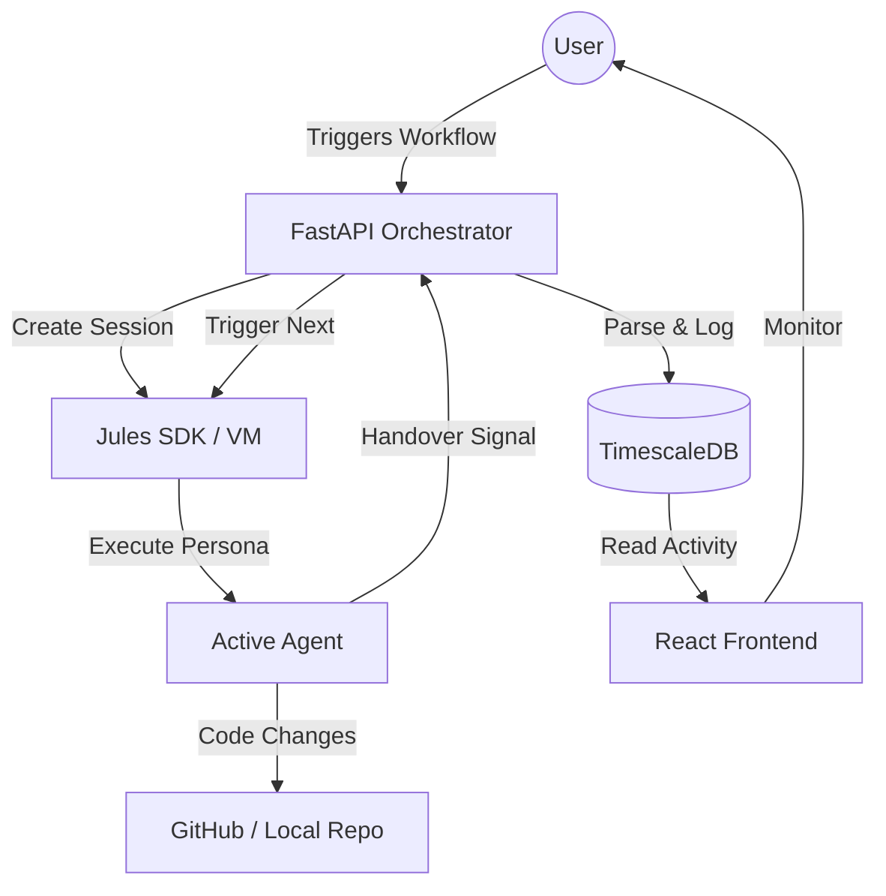

# 🏗️ JAO: System Architecture & Orchestration Blueprint
**Version**: 1.0.0 (Professional Edition)
**Status**: ACTIVE / AUTONOMOUS

---

## 🏛️ 100% Target Architecture Overview

The Jules Agent Orchestrator (JAO) is a **Cybernetic Firm Infrastructure**. This document serves as the **Target Blueprint**. If the current codebase (50%) does not match this blueprint, it is considered "Feature Pending." The system is designed to grow into this exact structure.

### 🛠️ Core Technology Stack (100% Production Spec)
| Layer | Technology | Role |
| :--- | :--- | :--- |
| **Frontend** | React 18, Vite, Lucide | **Pro Dashboard**: Management of API keys, Repo selection, and Agent Status switches. |
| **Backend** | FastAPI (Python 3.11) | **Autonomous Hub**: Processes signals, manages DB state, and handles Jules API transactions. |
| **Orchestration** | Signal-Driven State Machine | Parses terminal outputs for `[NEXT_AGENT]` and `[TASK_DONE]` signals. |
| **Database** | TimescaleDB | **Source of Truth**: Stores Prompts, Skills, Activity logs, and Session history. |
| **AI Engine** | Jules SDK | **Compute Layer**: Isolated VMs for each agent session. |

---

## 🔄 The Autonomous Orchestration Loop

The system operates on an **Agent-Native Lifecycle**. Instead of linear execution, it uses a recursive loop where agents check, build, audit, and verify each other.

### 🔄 The "Document-First" Workflow (The Firm's Pulse)
The system no longer relies on volatile chat history or regex parsing of agent outputs. Instead, it uses a strict **Filesystem Blackboard Architecture** where the `.jao/` directory is the absolute source of truth.

1.  **The Trigger**: A user links a new GitHub repository to JAO.
2.  **The Bootstrap**: The Orchestrator automatically spawns the `@onboard` agent. This agent scans the repo, creates the `.jao/` folder, and initializes the `project_map.md` and `task_board.md` (and specific dashboards for Developers, Auditors, and Testers). It then writes the first architectural task and assigns `@ada`.
3.  **The Orchestrator Loop**: The JAO Backend Orchestrator constantly monitors the `.jao/` folder. It reads the dashboards to see which agent is assigned to the current active task.
4.  **The Assignment**: The Orchestrator creates a session for the assigned agent, injects the current contents of the `.jao/` dashboard and project map into their context, and lets them execute.
5.  **The Implementation**: The agent works, updates files, updates the dashboards (e.g., checks off their task and assigns the next agent), and completes.
6.  **Session Management**: The Orchestrator checks the session completion, reads the updated `.jao/` state, clears/deletes the old session, and immediately spawns the newly assigned agent. Zero manual interaction.
### 1. The Decision Engine & Workflow Ledger (Blackboard Ledger)
To solve the "Asynchronous Handover" problem (where an agent pushes to a PR and waits), the system uses a **Workflow Ledger**:

- **Location**: `JAO/state/active_workflows.json` (Local) and `workflow_runs` table (DB).
- **Structure**:
  ```json
  {
    "session_id": "99ea-123",
    "current_holder": "@pydan",
    "status": "PROCESSING",
    "handover_file": "JAO/sessions/99ea-123/handover.md",
    "branch": "feature/ui-update-99ea"
  }
  ```

### 2. The "Handover Handshake" (Event-Driven)
1.  **Commit Trigger**: When an agent finishes, it commits its work and the `handover.md` to a new branch.
2.  **Webhook Detection**: The JAO Backend receives a GitHub `push` or `pull_request` webhook.
3.  **Blackboard Check**: The Orchestrator reads the code *inside the PR* (using GitHub API) to extract the `handover.md`.
4.  **Autonomous Spawn**: The Orchestrator automatically spawns the `next_agent` defined in the handover, passing the PR's content as context.

### 3. Context Injection (The "Born with Memory" Hack)
The biggest problem in multi-agent systems is "Context Loss." JAO solves this via **Injection**:

- **Mechanism**: When the Orchestrator starts a new agent session, it prepends the previous agent's output file to the system prompt.
- **Implementation**:
  ```python
  previous_work = read_file("JAO-123-A_BLUEPRINT.md")
  jules.sessions.create(
      prompt=f"You are @priya. Here is the blueprint you must engineers: {previous_work}"
  )
  ```
- **Result**: The agent feels like it was "part of the conversation" from the start.
- **Autonomous Teardown**: As soon as an agent emits a `Done ✅` signal, the Orchestrator immediately:
    1. Synchronizes the VM filesystem with the main repository.
    2. Flushes the ephemeral session memory to the **Global Context Store** in TimescaleDB.
    3. Terminates the Jules VM to reclaim credits/resources.
    4. Automatically spawns the next agent from the queue.

### 3. "The Fielding" & Spare Parts System
We use a **Dynamic Fielder Model**. Agents are treated as interchangeable parts based on their specialization.
-**Initialization Scan**: Before any task, `@onboard` performs a "Ground Check" to verify all agents are mapped to the correct project paths. 
-**Specialized Deployment**: Auditing agents (like `@scalper_auditor`) are "Bench Players." They are only moved to the "Active Field" when a specific module failure is detected.

---

## 📈 Data Flow Diagram (Mermaid)



---

## 📡 Jules API Integration Detail

### Function: `create_session`
- **Purpose**: Spawns a dedicated AI instance with a specific persona.
- **Data Flow**: `Backend -> Jules -> VM Initialization`.
- **Functions used**: `client.sessions.create(prompt, source, title, require_plan_approval)`.

### Function: `list_activities`
- **Purpose**: The "Persistence Engine." It pulls every command and terminal output from the agent's VM.
- **Data Flow**: `Jules -> Backend -> TimescaleDB`.
- **Functions used**: `client.activities.list_all(session_id)`.

---

## 🚀 Portability & @onboard Logic
The system is designed to be **Zero-Config Portable**.
1. **Verification**: When `@onboard` starts, it identifies the project root.
2. **Scan**: It identifies the "Naming Conventions" of the new project (e.g., is it `scr/` or `app/`?).
3. **Synchronization**: It performs a bulk find-and-replace across all 29+ agent `.md` files, updating the `References` box so every agent knows exactly where to look for the new code.

---

## 🗄️ Section 4: The Agent Skills Registry (Database Table)

In version 1.0.0, agents are no longer just files. They are stored in the `agents` table:
```sql
CREATE TABLE agents (
    agent_id TEXT PRIMARY KEY,
    persona_prompt TEXT,       -- The detailed instructions for Jules
    skills TEXT[],             -- e.g. ['python', 'react', 'auditing']
    status TEXT DEFAULT 'ACTIVE', -- ACTIVE/INACTIVE toggle
    priority INTEGER DEFAULT 1,
    assigned_vms INTEGER DEFAULT 0
);
```
- **Activation Switch**: Users can deactivate any agent from the UI. The Orchestrator will skip deactivated agents during the rotation.
- **Skill-Based Assignment**: If Agent A gives work that requires "Auditing," the Orchestrator queries the DB for agents with the `auditing` skill and reasonable `priority`.

---

## 🌌 Hyper-Autonomous Tier (Enterprise Ready)
For the 100% production goal, JAO implements a standalone **Autonomy Layer**.
- **Event-Driven Resolution**: Uses GitHub Webhooks to trigger agents for PR conflicts and code reviews without human intervention.
- **Continuous Innovation**: Enters a "Brainstorming Mode" during idle periods to propose and architect new features.
- **Inter-Agent Messaging**: A persistent "Reply Queue" allowing agents to send instructions across different work sessions.

**See [HYPER_AUTONOMOUS_FIRM.md](file:///c:/Users/vamsh/Desktop/jules%20agents%20personas/jewels_agents/blueprints/HYPER_AUTONOMOUS_FIRM.md) for the full technical specification.**
